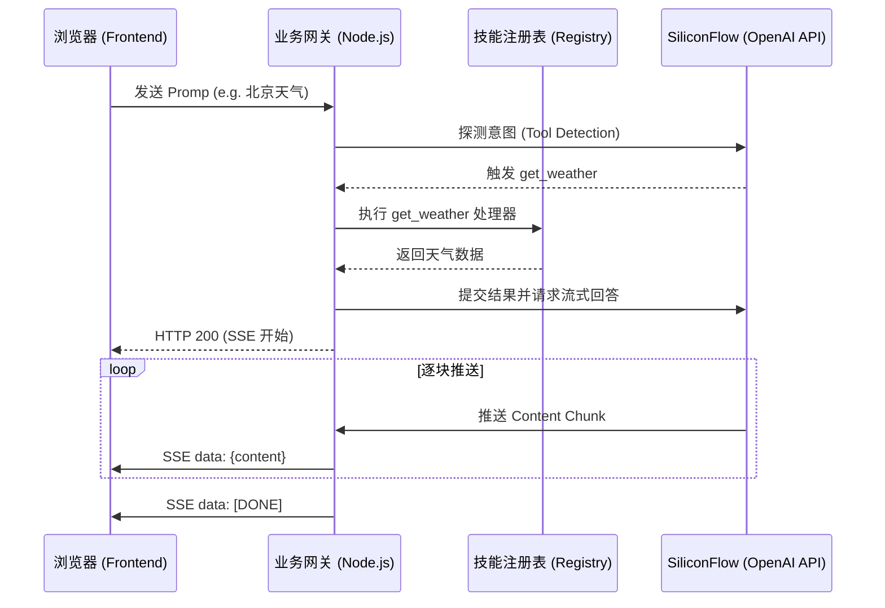

# AI Skill Server 项目教程与架构设计手册

本指南旨在深入解析 AI Skill Server 的设计思想、技术演进路径以及如何基于此框架快速扩展 AI 能力。

---

## 1. 系统愿景
构建一个**“技能驱动型”**的 AI 中台。它不仅能通过大模型进行对话，更能感知环境、调用定制化的业务工具，并以极低的延迟（流式）反馈结果，实现“思考即行动”。

## 2. 核心架构设计

### 2.1 技能分类体系 (Skill Taxonomy)
为了实现长期的可维护性，我们将 Skill 抽象化并划分为两个维度：
- **自研 Skill (Internal)**: 专为特定业务场景设计，通常涉及私有数据查询或复杂的内部 API 调用（如：内部天气系统）。
- **第三方 Skill (External)**: 提供通用能力的扩展（如：公网搜索、实时时间、货币转换）。

**设计理念**：采用**接口契约（Interface Contract）**模式。通过定义统一的 `ISkill` 接口，所有的技能逻辑被物理隔离在各自的文件中，由 `SkillRegistry` 统一调度。

### 2.2 动态能力发现机制 (Capabilities Discovery)
AI 如何知道自己会什么？
我们通过在**系统提示词 (System Prompt)** 中动态注入 `SkillRegistry` 生成的技能描述列表。这意味着你只需在对应的目录下新建一个 Skill 文件，AI 就会在下一次对话中自动学会如何介绍和使用它，无需手动修改 AI 的背景设定。

---

## 3. 关键技术方案复盘

### 3.1 从独占到共享：MySQL 权限突破
在项目初期，由于 MySQL 默认配置仅允许 `localhost` 连接，导致服务在局域网部署时失效。
- **解决方案**：重构数据库权限，授予 `root@%` 全局访问权限，并将服务绑定至 `0.0.0.0`。
- **设计思维**：开发环境的联通性（Connectivity）是快速迭代的前提。

### 3.2 极速响应：流式输出 (SSE) 的实现
对于 AI 应用，Perceived Performance（感知性能）至关重要。
- **挑战**：在启用 Function Calling（工具调用）时，流式输出变得复杂。
- **逻辑实现**：
    1.  **同步拦截**：后端首先探测 AI 是否需要调用工具。
    2.  **本地执行**：如果需要，服务器先行处理工具逻辑（如查天气）。
    3.  **流式续写**：将工具执行结果反馈给 AI，随后开启 Server-Sent Events (SSE) 流，将 AI 的最终回答逐字推送给前端。

### 3.3 官方 SDK 的力量：OpenAI 协议标准化
虽然最初使用 `axios` 模拟 POST 请求，但在引入流式和复杂工具调用后，手动解析 HTTP 流变得极其脆弱。
- **优化建议**：切换至官方 `openai` Node.js SDK。它不仅简化了代码，还提供了完善的类型定义。

---

## 4. 核心流程图

---

## 5. 开发者建议：如何添加新 Skill？

只需简单三步：
1.  **编写 Skill 文件**：在 `src/skills/external/` 下创建如 `searchSkill.ts`。
2.  **实现 I接口**：定义 `definition` (OpenAI 格式) 和 `handler` (逻辑函数)。
3.  **注册**：在 `src/skills/registry.ts` 的构造函数中调用 `this.register()`。

**恭喜！现在你可以开始构建属于自己的 AI 技能中台了。**
